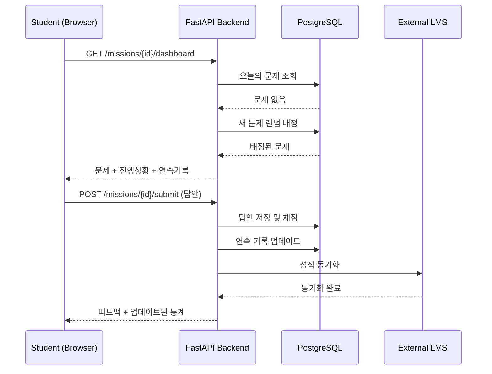

# 구현 문서: LMS 연동 오늘의 1문제 미션 시스템

## 📋 개요

이 문서는 LMS와 연동되는 "오늘의 1문제 미션" 시스템의 구현 세부사항을 설명합니다.

## 🎯 구현된 기능

### 1. 데이터베이스 스키마 (`database/migrations/0001_daily_missions.sql`)

완전한 PostgreSQL 스키마를 구현했습니다:

- **users**: 학생, 교사, 관리자 사용자 관리
- **daily_missions**: 일일 미션 정의 및 설정
- **mission_problems**: 문제 풀 관리
- **mission_enrollments**: 학생-미션 등록 관계
- **student_mission_progress**: 일별 학습 진행 상황
- **student_mission_streaks**: 연속 학습 기록 추적
- **daily_problem_assignments**: 일별 문제 자동 배정
- **mission_notifications**: 알림 시스템

### 2. 백엔드 API (`backend/`)

#### 핵심 서비스

**DailyMissionService** (`app/services/daily_mission_service.py`):
- 미션 CRUD 작업
- 일일 문제 자동 배정 로직 (7일 내 중복 방지)
- 답안 검증 및 피드백 생성
- 연속 학습 기록(Streak) 자동 업데이트
- 미션 분석 및 통계

**LMSIntegrationService** (`app/services/lms_integration.py`):
- 외부 LMS API 연동
- 사용자/과정 동기화
- 성적 자동 전송
- 학생 자동 등록

#### API 엔드포인트

**미션 관리** (`app/routes/missions.py`):
```
POST   /api/missions                          # 미션 생성
GET    /api/missions/{mission_id}             # 미션 조회
PUT    /api/missions/{mission_id}             # 미션 수정
GET    /api/missions/teacher/{teacher_id}     # 교사의 미션 목록
GET    /api/missions/student/{student_id}     # 학생의 미션 목록
POST   /api/missions/{mission_id}/enroll      # 학생 등록
GET    /api/missions/{mission_id}/daily-problem     # 오늘의 문제
POST   /api/missions/{mission_id}/submit            # 답안 제출
GET    /api/missions/{mission_id}/student/{student_id}/dashboard  # 대시보드
GET    /api/missions/{mission_id}/analytics         # 분석 데이터
```

**LMS 연동** (`app/routes/lms.py`):
```
GET    /api/lms/status                        # LMS 연결 상태
GET    /api/lms/user/{lms_user_id}           # 사용자 동기화
GET    /api/lms/course/{course_id}/students  # 과정 학생 목록
```

### 3. 프론트엔드 (`frontend/`)

#### React 컴포넌트

**DailyProblemCard** (`src/components/DailyProblemCard.tsx`):
- 문제 표시 및 답안 입력
- 타이머 기능
- 실시간 피드백
- 객관식/주관식 지원

**StreakDisplay** (`src/components/StreakDisplay.tsx`):
- 현재/최장 연속 기록
- 완료 문제 수
- 정답률 시각화
- 동기부여 메시지

**StudentDashboard** (`src/pages/StudentDashboard.tsx`):
- 통합 대시보드
- 오늘의 문제 표시
- 연속 기록 추적
- 미션 정보

#### API 서비스

**apiService** (`src/services/api.ts`):
- Axios 기반 HTTP 클라이언트
- 인증 토큰 관리
- 모든 백엔드 API 호출 래핑

## 🔄 핵심 워크플로우

### 1. 미션 생성 및 학생 등록

```
교사가 미션 생성 (LMS 과정 ID 포함)
    ↓
시스템이 LMS에서 학생 목록 조회
    ↓
학생을 자동으로 미션에 등록
    ↓
각 학생에게 알림 발송
```

### 2. 일일 문제 배정

```
학생이 대시보드 접속
    ↓
시스템이 오늘 배정된 문제 확인
    ↓
없으면: 문제 풀에서 랜덤 선택 (7일 내 중복 제외)
    ↓
daily_problem_assignments 테이블에 기록
    ↓
문제 표시
```

### 3. 답안 제출 및 채점

```
학생이 답안 제출
    ↓
서비스가 정답 검증
    ↓
student_mission_progress 업데이트
    ↓
연속 기록(Streak) 계산 및 업데이트
    ↓
LMS에 성적 동기화 (설정된 경우)
    ↓
즉시 피드백 반환
```

### 4. 연속 기록(Streak) 계산

```
답안 제출 시
    ↓
마지막 완료 날짜 확인
    ↓
어제인 경우: current_streak += 1
오늘이 아닌 경우: current_streak = 1
    ↓
longest_streak 업데이트 (필요시)
    ↓
total_completed, total_correct 증가
```

## 🔌 LMS 연동 상세

### 연동 포인트

1. **사용자 동기화**: LMS 사용자 ID로 자동 로그인/등록
2. **과정 연동**: LMS 과정의 학생을 미션에 자동 등록
3. **성적 전송**: 문제 완료 시 LMS에 성적 자동 전송
4. **과제 생성**: 미션을 LMS 과제로 생성 (선택)

### LMS API 요구사항

시스템이 기대하는 LMS API 엔드포인트:

```
GET  /users/{user_id}                  # 사용자 정보 조회
GET  /courses/{course_id}              # 과정 정보 조회
GET  /courses/{course_id}/students     # 과정 학생 목록
POST /grades                           # 성적 제출
POST /assignments                      # 과제 생성
GET  /health                           # 헬스 체크
```

### 인증

- Bearer Token 인증 사용
- 환경 변수 `LMS_API_KEY`로 설정

## 📊 데이터 흐름 예시

### 학생 일일 학습 플로우



## 🚀 배포 고려사항

### 환경 변수

필수:
- `DATABASE_URL`: PostgreSQL 연결 문자열
- `SECRET_KEY`: JWT 토큰 서명 키

선택:
- `LMS_API_URL`: 외부 LMS API URL
- `LMS_API_KEY`: LMS API 인증 키
- `LMS_SYNC_ENABLED`: LMS 동기화 활성화 여부

### 성능 최적화

1. **데이터베이스 인덱스**: 모든 주요 쿼리에 인덱스 생성됨
2. **문제 배정 캐싱**: Redis 캐시 추가 고려
3. **비동기 LMS 동기화**: Celery 작업 큐 사용 권장

### 확장성

- 읽기 전용 복제본으로 읽기 부하 분산
- Celery를 사용한 비동기 작업 처리
- CDN을 통한 정적 파일 제공

## 🧪 테스트 시나리오

### 단위 테스트 필요 영역

1. 답안 검증 로직
2. 연속 기록 계산
3. 문제 배정 알고리즘
4. LMS API 연동

### 통합 테스트

1. 전체 미션 생성 → 등록 → 풀이 → 채점 플로우
2. LMS 동기화 플로우
3. 대시보드 데이터 로딩

## 📝 향후 개선사항

1. **AI 문제 생성**: Claude API를 사용한 자동 문제 생성
2. **적응형 난이도**: 학생 성과에 따른 자동 난이도 조절
3. **실시간 알림**: WebSocket을 통한 실시간 알림
4. **모바일 앱**: React Native로 모바일 앱 개발
5. **리더보드**: 학생 간 경쟁 요소 추가
6. **배지 시스템**: 성취에 대한 배지 및 보상

## 🔧 문제 해결

### 일반적인 문제

**데이터베이스 연결 실패**:
```bash
# PostgreSQL 서비스 확인
sudo systemctl status postgresql

# DATABASE_URL 환경 변수 확인
echo $DATABASE_URL
```

**LMS 연동 실패**:
```bash
# LMS 상태 확인
curl http://localhost:8000/api/lms/status

# 로그 확인
tail -f backend/logs/app.log
```

**프론트엔드 API 호출 실패**:
```bash
# CORS 설정 확인
# backend/app/config.py의 CORS_ORIGINS 확인

# API URL 환경 변수 확인
cat frontend/.env
```

## 📚 참고 자료

- FastAPI 문서: https://fastapi.tiangolo.com/
- React 문서: https://react.dev/
- Material-UI: https://mui.com/
- PostgreSQL: https://www.postgresql.org/docs/

## 👥 기여자

이 시스템은 AI 교육 파이프라인 프로젝트의 일부로 개발되었습니다.
