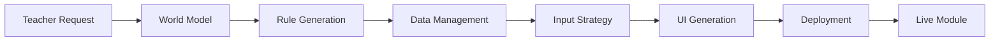

# AI Education System Pipeline
## KAIST Touch Math Academy

[](https://github.com)
[](LICENSE)
[](https://moodle.org)

---

## Overview

An intelligent, automated system that transforms teacher requests into complete educational modules. This AI-powered pipeline enables teachers to describe what they want in natural language, and the system automatically constructs the entire technical infrastructure—from data models to user interfaces—without requiring any coding knowledge.

### Vision

**Democratize Educational Technology**: Empower non-technical teachers to create sophisticated educational systems autonomously, reducing module creation time from weeks to hours while maintaining pedagogical quality and technical robustness.

---

## 🎯 Current Modules

### 1. Regularity Pattern (정다면체 규칙성 패턴)

An interactive 3D visualization module for exploring Platonic solids (regular polyhedra) through color pattern recognition.

**Status**: 📝 Specification Complete - Ready for Development

**Key Features**:
- 🔷 Interactive 3D models of all 5 Platonic solids
- 🎨 5 color pattern modes to visualize mathematical regularity
- 📱 Virtual smartphone interface (lower-right display)
- 🔢 Euler characteristic exploration (V - E + F = 2)
- 🔄 Symmetry axis visualization with animated color flows
- 🔗 LMS/Moodle integration via LTI 1.3
- ♿ WCAG 2.1 AA accessible

**Target Audience**: Middle school students (Grades 6-9)

**Technology Stack**:
- Frontend: React 18 + TypeScript + Three.js
- 3D Rendering: React Three Fiber (R3F)
- UI Components: Material-UI (MUI)
- LMS Integration: LTI 1.3 / iFrame embedding

**Documentation**: [📄 Regularity Pattern Module Spec](tasks/0002-regularity-pattern-module.md)

**Development Timeline**: 12 weeks (6 sprints)

---

## 🏗️ System Architecture

### AI Pipeline Stages



1. **World Model Reconstruction** - Understanding teacher requests and building domain models
2. **Rule Generation Engine** - Converting requirements into executable rules and ontologies
3. **Data Management** - Schema design, pseudo data generation, database creation
4. **Input Strategy Design** - Determining optimal data collection methods
5. **UI Auto-Generation** - Creating React components and interfaces
6. **Integration & Deployment** - API generation, testing, and containerization

---

## 🚀 Quick Start

### For Teachers (Module Requesters)

```bash
# Access the web interface
https://ai-pipeline.kaist.ac.kr

# Describe your module in natural language (Korean or English)
"3학년 학생들을 위한 분수 학습 모듈을 만들어주세요..."

# Review AI-generated module structure
# Approve and deploy
```

### For Developers

```bash
# Clone the repository
git clone https://github.com/kaist/ai-education-pipeline.git
cd ai-education-pipeline

# Install dependencies
npm install          # Frontend
pip install -r requirements.txt  # Backend

# Set up environment variables
cp .env.example .env
# Configure: DATABASE_URL, CLAUDE_API_KEY, etc.

# Run development servers
npm run dev          # Frontend (port 3000)
python main.py       # Backend (port 8000)

# Access at http://localhost:3000
```

### For LMS Administrators (Moodle Integration)

**Option 1: LTI 1.3 Integration** (Recommended)
```
Moodle → Site Administration → Plugins → External Tool
→ Configure a new external tool
→ LTI Launch URL: https://regularity-pattern.kaist.ac.kr/api/lti/launch
→ Enable grade passback
```

**Option 2: iFrame Embedding** (Simple)
```html
<!-- Add to Moodle page HTML -->
<iframe
  src="https://regularity-pattern.kaist.ac.kr/embed?student_id={USER_ID}"
  width="100%"
  height="800px"
  allow="accelerometer; gyroscope">
</iframe>
```

---

## 📚 Documentation

### Planning & Design
- [📄 Product Requirements Document](tasks/0001-prd-ai-education-pipeline.md) - Complete system PRD
- [📄 Regularity Pattern Module](tasks/0002-regularity-pattern-module.md) - Platonic solids visualization spec

### Technical Guides (Coming Soon)
- 🔧 API Documentation
- 🎨 UI Component Library
- 🗄️ Database Schema Reference
- 🔐 Security & Privacy Guidelines
- 🧪 Testing Strategy

### For Teachers (Coming Soon)
- 📖 Teacher's Guide to Module Creation
- 🎓 Best Practices for Educational Design
- ❓ FAQ and Troubleshooting

---

## 🛠️ Technology Stack

### Frontend
- **Framework**: React 18+ with TypeScript
- **State Management**: Zustand / Redux Toolkit
- **UI Library**: Material-UI (MUI) or Ant Design
- **3D Graphics**: Three.js + React Three Fiber (for 3D modules)
- **Forms**: React Hook Form + Yup validation
- **Build Tool**: Vite

### Backend
- **API Gateway**: Node.js with Express / Fastify
- **AI Pipeline**: Python 3.11+ with FastAPI
- **Task Queue**: Celery + Redis
- **AI Engine**: Claude 3 (Anthropic API)

### Database
- **Primary**: PostgreSQL 15+
- **Caching**: Redis 7+
- **LMS Compatibility**: MySQL 5.7 (for Moodle integration)

### DevOps
- **Containers**: Docker + Docker Compose
- **CI/CD**: GitHub Actions
- **Monitoring**: Prometheus + Grafana
- **Logging**: ELK Stack (Elasticsearch, Logstash, Kibana)

### LMS Integration
- **Protocol**: LTI 1.3 (Learning Tools Interoperability)
- **Supported LMS**: Moodle 3.7+, Canvas, Blackboard (future)

---

## 🎯 Success Metrics

### Primary KPIs
- ✅ **Adoption Rate**: >70% of teachers using the system within 6 months
- ⚡ **Generation Speed**: Average module creation time < 2 hours
- 🎯 **System Accuracy**: >85% of generated modules require minimal adjustments
- ⏱️ **Time Savings**: 80% reduction vs. manual development (40-80 hours → 8 hours)
- 😊 **Teacher Satisfaction**: Net Promoter Score (NPS) > 50

### Module-Specific (Regularity Pattern)
- 📈 **Engagement**: >80% of students complete all 5 polyhedron explorations
- 🎯 **Accuracy**: >90% accuracy on Euler characteristic verification
- 🧠 **Retention**: Students recall polyhedron properties 1 week later
- ⏰ **Time to Mastery**: <30 minutes to explore all 5 polyhedra

---

## 🗓️ Development Roadmap

### Phase 0: Discovery & Setup ✅ (Weeks 1-2)
- [x] Codebase exploration and assessment
- [x] Infrastructure setup planning
- [x] Product requirements documentation
- [x] Regularity Pattern module specification

### Phase 1: Core Pipeline (Weeks 3-8)
- [ ] World Model Reconstruction engine
- [ ] Rule Generation algorithm
- [ ] Complexity analysis system

### Phase 2: Data & Persistence (Weeks 9-12)
- [ ] Database schema auto-generation
- [ ] Pseudo data generator
- [ ] Migration management

### Phase 3: Input & Interaction (Weeks 13-16)
- [ ] Input strategy designer
- [ ] Dynamic form generator
- [ ] Validation system

### Phase 4: UI Generation (Weeks 17-22)
- [ ] React component generator
- [ ] UX journey analyzer
- [ ] Accessibility implementation

### Phase 5: Deployment & Testing (Weeks 23-26)
- [ ] API endpoint generator
- [ ] Docker containerization
- [ ] Integration testing

### Phase 6: Launch & Iteration (Weeks 27-30)
- [ ] Beta launch with pilot teachers
- [ ] Feedback collection and refinement
- [ ] General availability release

### Regularity Pattern Module (Parallel Track)
- [ ] Sprint 1-2: Core 3D visualization
- [ ] Sprint 3-4: Color pattern modes
- [ ] Sprint 5-6: Interactive activities
- [ ] Sprint 7-8: LMS integration
- [ ] Sprint 9-10: Analytics & polish
- [ ] Sprint 11-12: Testing & launch

---

## 🤝 Contributing

We welcome contributions from developers, educators, and researchers!

### How to Contribute

1. **Fork the repository**
2. **Create a feature branch**: `git checkout -b feature/amazing-feature`
3. **Commit your changes**: `git commit -m 'Add amazing feature'`
4. **Push to the branch**: `git push origin feature/amazing-feature`
5. **Open a Pull Request**

### Development Branches

- `main` - Production-ready code
- `develop` - Integration branch for features
- `claude/*` - AI agent development branches
- `feature/*` - Feature development branches

**Current Active Branch**: `claude/add-regularity-pattern-01929yeyYdJdVjJHrNGb5N3K`

### Code Style

- **TypeScript/JavaScript**: ESLint + Prettier
- **Python**: Black + Flake8 + mypy
- **Commits**: Conventional Commits format
  ```
  feat: add new feature
  fix: resolve bug
  docs: update documentation
  test: add tests
  refactor: code refactoring
  ```

---

## 📋 Requirements

### Minimum Requirements
- **Node.js**: 18.0+
- **Python**: 3.11+
- **PostgreSQL**: 15+ (or MySQL 5.7 for Moodle compatibility)
- **Redis**: 7+
- **Docker**: 20.10+

### For LMS Integration
- **Moodle**: 3.7+ (with LTI 1.3 support)
- **PHP**: 7.1+ (for Moodle)
- **MySQL**: 5.7+ (if using Moodle database integration)

### Browser Support
- Chrome 90+
- Firefox 88+
- Safari 14+
- Edge 90+
- Mobile: iOS Safari 14+, Chrome Android 90+

---

## 🔐 Security & Privacy

### Data Protection
- ✅ AES-256 encryption at rest
- ✅ TLS 1.3 for data in transit
- ✅ Role-Based Access Control (RBAC)
- ✅ Comprehensive audit logging

### Compliance
- 📜 FERPA (Family Educational Rights and Privacy Act)
- 📜 COPPA (Children's Online Privacy Protection Act)
- 📜 PIPA (Personal Information Protection Act - Korea)
- 📜 GDPR considerations for international users

### Code Generation Security
- 🛡️ Sandboxed code execution (Docker)
- 🛡️ Static analysis for vulnerabilities
- 🛡️ Whitelist-only imports
- 🛡️ SQL injection prevention

---

## 📞 Support & Contact

### For Teachers
- 📧 Email: teachers@kaist-touch-math.ac.kr
- 📚 Documentation: [Teacher's Guide](docs/teachers-guide.md)
- 💬 Support Portal: https://support.kaist-touch-math.ac.kr

### For Developers
- 🐛 Issue Tracker: [GitHub Issues](https://github.com/kaist/ai-education-pipeline/issues)
- 💻 Developer Docs: [API Documentation](docs/api.md)
- 💬 Slack: #ai-pipeline-dev

### For System Administrators
- 🔧 Technical Support: sysadmin@kaist-touch-math.ac.kr
- 📊 Monitoring Dashboard: https://monitoring.kaist-touch-math.ac.kr
- 📖 Deployment Guide: [docs/deployment.md](docs/deployment.md)

---

## 📜 License

This project is licensed under the MIT License - see the [LICENSE](LICENSE) file for details.

---

## 🙏 Acknowledgments

### Institutions
- **KAIST** (Korea Advanced Institute of Science and Technology)
- **KAIST Touch Math Academy**

### Technologies
- **Anthropic Claude** - AI reasoning engine
- **Three.js** - 3D visualization
- **React** - UI framework
- **PostgreSQL** - Database
- **Moodle** - LMS platform

### Inspirations
- GeoGebra - Interactive geometry software
- Brilliant.org - Interactive math education
- Khan Academy - Accessible education for all

---

## 📊 Project Stats

- **Lines of Specification**: 2,500+ (PRD + Module Specs)
- **Planned Modules**: 1 (Regularity Pattern) + Unlimited via AI generation
- **Supported Languages**: Korean, English
- **Target Users**: Teachers (50-100), Students (500-1000)
- **Development Timeline**: 30 weeks to MVP

---

## 🔮 Future Vision

### Phase 2 Enhancements
- 🤖 Robot Avatar Integration (physical teaching assistants)
- 🎮 Advanced gamification and achievement systems
- 📊 Predictive analytics and adaptive learning
- 🌐 Multi-subject support (beyond mathematics)
- 🗣️ Voice input for teacher requests
- 👥 Multi-teacher collaboration features

### Phase 3 Expansion
- 🏪 Module marketplace for sharing between institutions
- 🌍 International expansion and localization
- 📱 Native mobile apps (iOS, Android)
- 🎥 Automatic instructional video generation
- 🧬 Integration with science simulations (chemistry, physics, biology)

---

## 📈 Current Status

**Project Status**: 📝 **Planning & Specification Phase**

**Last Updated**: 2025-11-18

**Active Development Branch**: `claude/add-regularity-pattern-01929yeyYdJdVjJHrNGb5N3K`

**Next Milestone**: Regularity Pattern prototype (Sprint 1-2)

---

*Built with ❤️ by KAIST Touch Math Academy*

*Powered by Claude (Anthropic AI)*
