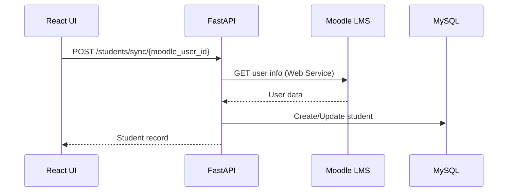
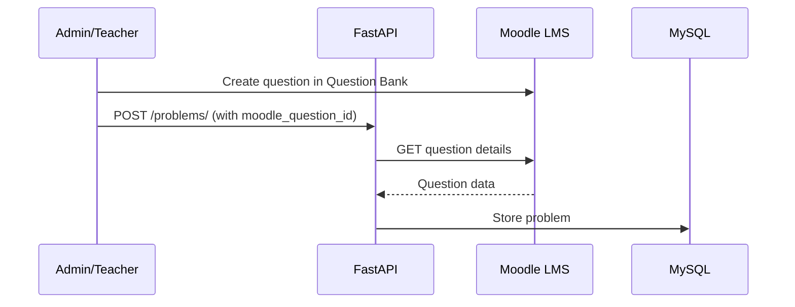
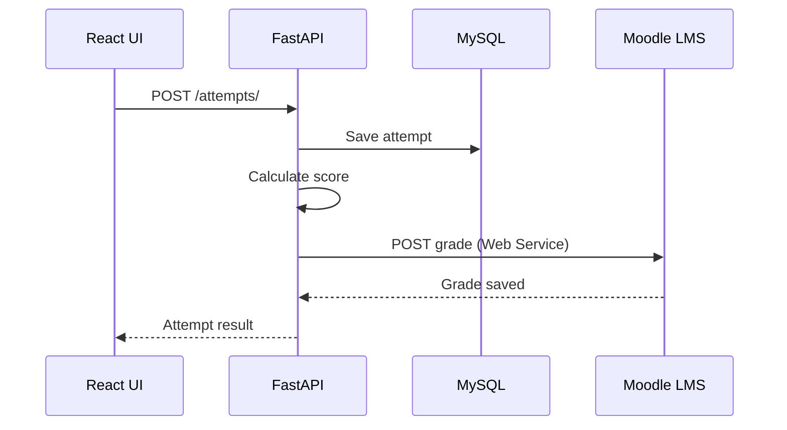

# Moodle Integration Guide

## Overview

This application integrates with Moodle 3.7 to fetch student information, retrieve problems, and submit grades back to the LMS.

## Architecture

```
┌─────────────────┐         ┌──────────────────┐         ┌─────────────┐
│  Moodle LMS     │◄────────┤  FastAPI Backend │◄────────┤   React UI  │
│  (PHP 7.1.9)    │  REST   │   (Python 3.11)  │  HTTP   │  (Browser)  │
│  MySQL 5.7      │   API   │                  │         │             │
└─────────────────┘         └──────────────────┘         └─────────────┘
```

## Moodle Web Services Setup

### Step 1: Enable Web Services

1. Log in to Moodle as administrator
2. Navigate to: **Site Administration → Advanced Features**
3. Enable **"Enable web services"**
4. Save changes

### Step 2: Enable REST Protocol

1. Go to: **Site Administration → Server → Web Services → Manage Protocols**
2. Enable **REST protocol**

### Step 3: Create Service Role

1. Navigate to: **Site Administration → Users → Permissions → Define Roles**
2. Click **"Add a new role"**
3. Use archetype: **"Manager"** or create custom
4. Grant capabilities:
   - `webservice/rest:use`
   - `moodle/user:viewdetails`
   - `moodle/question:viewall`
   - `mod/assign:grade`

### Step 4: Create Web Service User

1. Navigate to: **Site Administration → Users → Accounts → Add a new user**
2. Create user with credentials:
   - Username: `webservice_user`
   - Email: `webservice@yourdomain.com`
3. Assign the web service role created in Step 3

### Step 5: Create External Service

1. Go to: **Site Administration → Server → Web Services → External Services**
2. Click **"Add"**
3. Configure:
   - Name: `Permutation Pattern Service`
   - Short name: `permutation_pattern`
   - Enabled: ✓
   - Authorized users only: ✓

### Step 6: Add Functions to Service

Add these functions to the service:

| Function | Purpose |
|----------|---------|
| `core_user_get_users_by_field` | Fetch student information |
| `core_question_get_question` | Retrieve question details |
| `core_question_get_questions` | Get all questions for a course |
| `mod_assign_save_grade` | Submit grades back to Moodle |
| `core_course_get_courses` | List available courses |

To add functions:
1. Click on **"Functions"** for your service
2. Click **"Add functions"**
3. Search and add each function above

### Step 7: Authorize User for Service

1. In **External Services**, click on **"Authorized users"**
2. Add the `webservice_user` created in Step 4

### Step 8: Generate Token

1. Navigate to: **Site Administration → Server → Web Services → Manage Tokens**
2. Click **"Add"**
3. Select:
   - User: `webservice_user`
   - Service: `Permutation Pattern Service`
4. Click **"Save changes"**
5. **Copy the generated token** (you'll need this for configuration)

## Application Configuration

### Update .env File

```bash
# Moodle Configuration
MOODLE_URL=https://your-moodle-instance.com
MOODLE_API_TOKEN=your_generated_token_here
MOODLE_VERSION=3.7
```

### Test Connection

```bash
# From backend directory
python -c "
from app.utils.moodle import moodle_client
import asyncio

async def test():
    try:
        user = await moodle_client.get_user_info(2)  # Test with user ID 2
        print('Success:', user)
    except Exception as e:
        print('Error:', e)

asyncio.run(test())
"
```

## Data Flow

### 1. Student Sync



### 2. Problem Fetch



### 3. Grade Submission



## Custom Integration Points

### backend/app/utils/moodle.py

The `MoodleClient` class provides methods for Moodle integration:

```python
from app.utils import moodle_client

# Get user information
user = await moodle_client.get_user_info(user_id=123)

# Get question details
question = await moodle_client.get_question(question_id=456)

# Submit grade
result = await moodle_client.submit_grade(
    user_id=123,
    assignment_id=789,
    grade=85.5,
    feedback="Great work!"
)

# Get course problems
problems = await moodle_client.get_course_problems(course_id=1)
```

## Syncing Questions from Moodle

### Creating Questions in Moodle

1. Navigate to **Question Bank** in your course
2. Create a new question:
   - Type: **"Essay"** or custom type
   - Add question text
   - Save

3. Note the **Question ID** (visible in URL)

### Importing to Application

Use the API to create a problem linked to Moodle:

```bash
curl -X POST "http://localhost:8000/api/v1/problems/" \
  -H "Content-Type: application/json" \
  -d '{
    "pattern_type_id": 1,
    "moodle_question_id": 123,
    "title": "Pattern from Moodle",
    "description": "Solve the pattern",
    "initial_sequence": ["A", "B", "C"],
    "target_sequence": ["C", "A", "B"],
    "difficulty_level": "beginner",
    "time_limit_seconds": 300,
    "max_attempts": 3,
    "points": 10
  }'
```

## Assignment Integration

### Creating Assignment in Moodle

1. In your course, **Add an activity** → **Assignment**
2. Configure:
   - Name: "Permutation Pattern Practice"
   - Submission type: **"No online submissions"** (grades only)
3. Note the **Assignment ID**

### Auto-Grade Submission

When students submit answers, grades are automatically sent:

```python
# In backend/app/api/attempts.py
# After calculating score:

await moodle_client.submit_grade(
    user_id=student.moodle_user_id,
    assignment_id=ASSIGNMENT_ID,  # Configure in settings
    grade=attempt.score,
    feedback=attempt.feedback
)
```

## Troubleshooting

### Error: "Access control exception"

**Cause**: User doesn't have permission or service not authorized

**Solution**:
- Verify user is authorized for the service
- Check role capabilities include `webservice/rest:use`

### Error: "Invalid token"

**Cause**: Token expired or incorrect

**Solution**:
- Regenerate token in Moodle
- Update `.env` file with new token

### Error: "Function not available"

**Cause**: Required function not added to service

**Solution**:
- Add missing function to the external service
- Refer to Step 6 above

### Connection Timeout

**Cause**: Moodle server unreachable or firewall blocking

**Solution**:
- Verify `MOODLE_URL` is correct
- Check firewall rules
- Test with: `curl https://your-moodle-instance.com/webservice/rest/server.php`

## Security Considerations

1. **Token Storage**: Never commit tokens to version control
2. **HTTPS Only**: Always use HTTPS for Moodle URL in production
3. **IP Restrictions**: Configure Moodle to accept API calls only from trusted IPs
4. **Token Rotation**: Regularly rotate web service tokens
5. **Audit Logs**: Monitor Moodle logs for API usage

## Performance Optimization

1. **Caching**: Cache user info and question data
2. **Batch Operations**: Use batch API calls when available
3. **Async Calls**: All Moodle calls are async to prevent blocking
4. **Rate Limiting**: Implement rate limiting to avoid overloading Moodle

## Alternative: LTI Integration (Future)

For deeper integration, consider LTI (Learning Tools Interoperability):

- Launch app from within Moodle course
- SSO authentication
- Grade passback via LTI Outcomes
- Deep linking support

This requires additional implementation but provides better UX.

## Support

For Moodle-specific issues:
- Moodle Documentation: https://docs.moodle.org/
- Web Services: https://docs.moodle.org/en/Web_services
- Developer Forum: https://moodle.org/course/view.php?id=5
