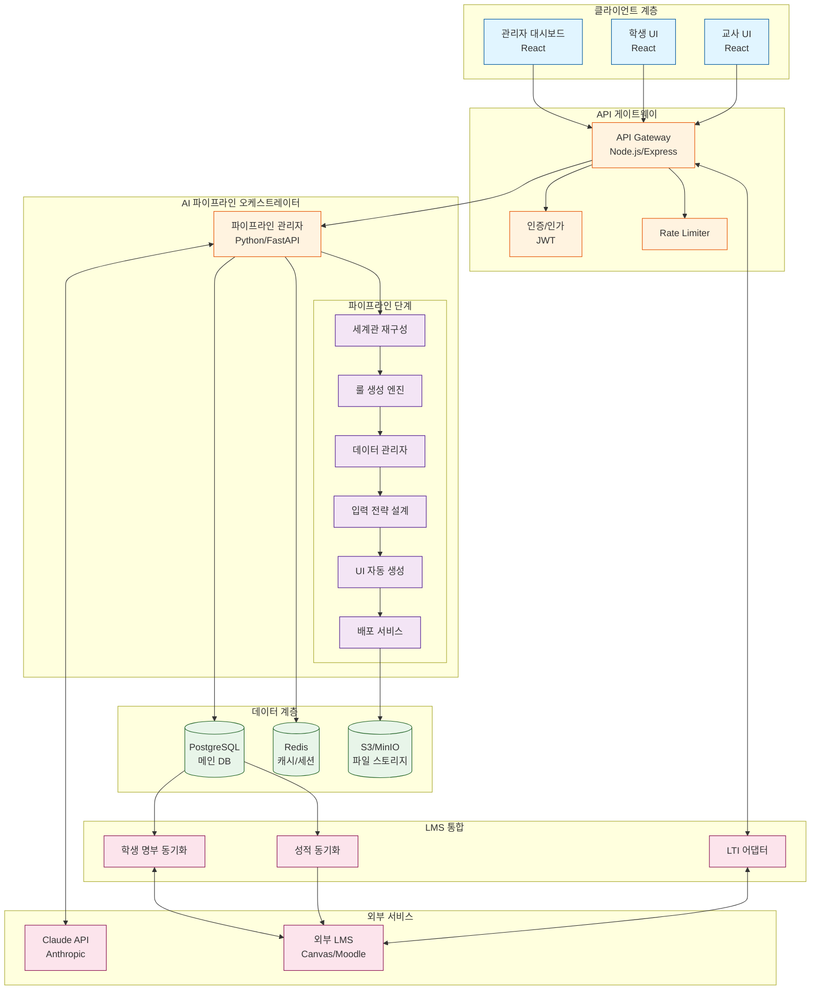
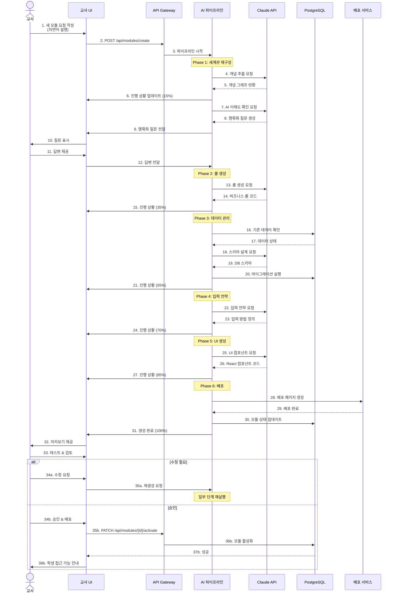
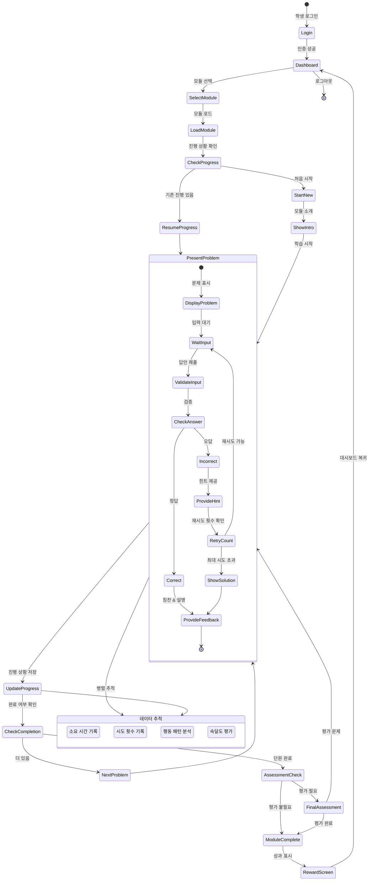
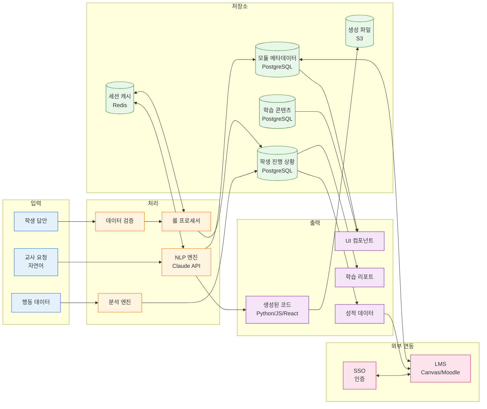
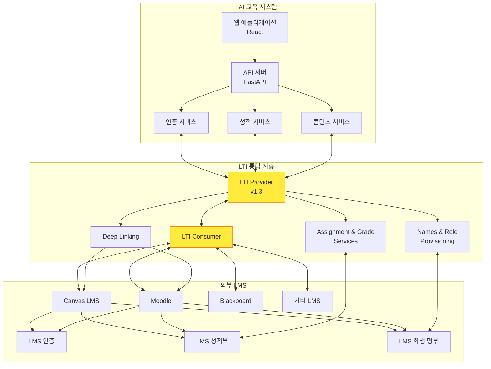
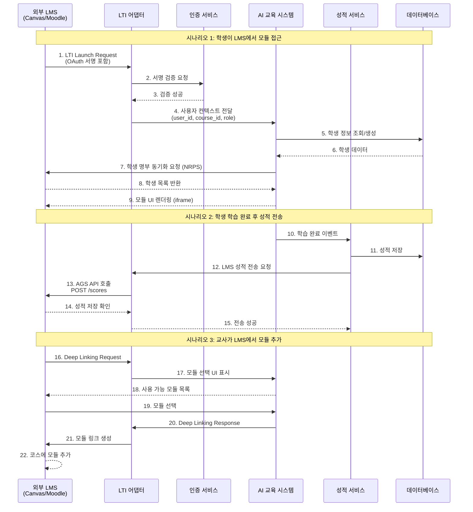
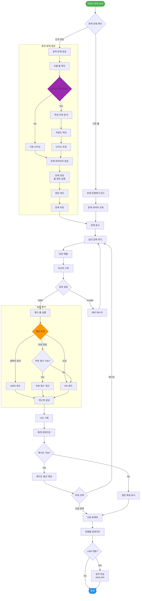
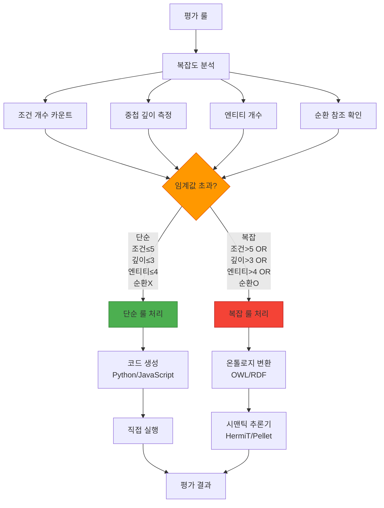

# LMS Integration & Problem Flow Diagrams

> AI 교육 시스템 파이프라인의 LMS 연동 및 문제 흐름 정리

## 목차
1. [전체 시스템 아키텍처](#1-전체-시스템-아키텍처)
2. [AI 파이프라인 흐름](#2-ai-파이프라인-흐름)
3. [교사 모듈 생성 워크플로우](#3-교사-모듈-생성-워크플로우)
4. [학생 학습 흐름](#4-학생-학습-흐름)
5. [데이터 흐름도](#5-데이터-흐름도)
6. [LMS 연동 아키텍처](#6-lms-연동-아키텍처)
7. [문제 생성 및 평가 프로세스](#7-문제-생성-및-평가-프로세스)

---

## 1. 전체 시스템 아키텍처

---

## 2. AI 파이프라인 흐름

```mermaid
flowchart TD
    Start([교사 요청 입력]) --> ParseRequest[자연어 요청 파싱<br/>NLP 처리]

    ParseRequest --> WorldModel[Phase 1: 세계관 재구성]

    subgraph "Phase 1: 세계관 재구성"
        WM1[개념 추출<br/>Concept Extraction]
        WM2[관계 매핑<br/>Relationship Mapping]
        WM3[연산 정의<br/>Operation Definition]
        WM4[개념 그래프 생성<br/>Concept Graph]

        WM1 --> WM2 --> WM3 --> WM4
    end

    WorldModel --> RuleGen[Phase 2: 룰 생성]

    subgraph "Phase 2: 룰 생성 엔진"
        RG1{복잡도 분석}
        RG2A[단순 룰 → 코드 생성<br/>Python/JavaScript]
        RG2B[복잡 룰 → 온톨로지 변환<br/>OWL/RDF]
        RG3[검증 룰 생성]

        RG1 -->|단순| RG2A
        RG1 -->|복잡| RG2B
        RG2A --> RG3
        RG2B --> RG3
    end

    RuleGen --> DataMgmt[Phase 3: 데이터 관리]

    subgraph "Phase 3: 데이터 관리"
        DM1{기존 데이터 확인}
        DM2A[데이터 있음<br/>스키마 매핑]
        DM2B[데이터 없음<br/>Pseudo 데이터 생성]
        DM3[DB 스키마 설계<br/>3NF 정규화]
        DM4[마이그레이션 실행<br/>인덱스 생성]

        DM1 -->|존재| DM2A
        DM1 -->|부재| DM2B
        DM2A --> DM3
        DM2B --> DM3
        DM3 --> DM4
    end

    DataMgmt --> InputStrategy[Phase 4: 입력 전략]

    subgraph "Phase 4: 입력 전략 설계"
        IS1[입력 방법 결정]
        IS2[폼 입력 vs 행동 추적 vs 대화형]
        IS3[검증 전략 수립]
        IS4[데이터 흐름 매핑]

        IS1 --> IS2 --> IS3 --> IS4
    end

    InputStrategy --> UIGeneration[Phase 5: UI 생성]

    subgraph "Phase 5: UI 자동 생성"
        UI1{기존 UI 재사용 가능?}
        UI2A[기존 컴포넌트 재사용]
        UI2B[새 컴포넌트 생성]
        UI3[UX 여정 분석]
        UI4[React 컴포넌트 생성<br/>접근성 적용]
        UI5[스타일링 & 반응형]

        UI1 -->|가능| UI2A
        UI1 -->|불가능| UI2B
        UI2A --> UI3
        UI2B --> UI3
        UI3 --> UI4 --> UI5
    end

    UIGeneration --> Deploy[Phase 6: 배포]

    subgraph "Phase 6: 시스템 완성"
        DP1[API 엔드포인트 생성]
        DP2[통합 테스트 생성]
        DP3[Docker 컨테이너화]
        DP4[문서 자동 생성]
        DP5[배포 실행]

        DP1 --> DP2 --> DP3 --> DP4 --> DP5
    end

    Deploy --> Review{교사 검토}
    Review -->|수정 필요| Refine[피드백 반영<br/>재생성]
    Review -->|승인| Complete([모듈 활성화<br/>학생 접근 가능])

    Refine --> WorldModel

    style Start fill:#4caf50,stroke:#2e7d32,color:#fff
    style Complete fill:#2196f3,stroke:#0d47a1,color:#fff
    style Review fill:#ff9800,stroke:#e65100
```

---

## 3. 교사 모듈 생성 워크플로우

---

## 4. 학생 학습 흐름

---

## 5. 데이터 흐름도

---

## 6. LMS 연동 아키텍처

### LMS 연동 시나리스

---

## 7. 문제 생성 및 평가 프로세스

### 평가 룰 복잡도 분석

---

## 구현 우선순위

### Phase 1 (MVP) - 필수 기능
1. ✅ 교사 모듈 요청 처리
2. ✅ AI 파이프라인 (세계관 → 룰 → 데이터 → UI)
3. ✅ 학생 학습 기본 흐름
4. ✅ 단순 룰 엔진
5. ✅ 기본 UI 생성 (폼 중심)

### Phase 2 - LMS 통합
1. 🔄 LTI 1.3 Provider 구현
2. 🔄 Canvas/Moodle 연동
3. 🔄 성적 동기화 (AGS)
4. 🔄 학생 명부 동기화 (NRPS)

### Phase 3 - 고급 기능
1. ⏳ 복잡 룰 → 온톨로지 변환
2. ⏳ 적응형 난이도 조정
3. ⏳ 대화형 UI
4. ⏳ 멀티 LMS 지원 확장

---

## 기술 스택 요약

| 계층 | 기술 |
|------|------|
| Frontend | React 18, TypeScript, Material-UI |
| API Gateway | Node.js, Express/Fastify |
| AI Pipeline | Python 3.11+, FastAPI, Claude API |
| Database | PostgreSQL 15+, Redis 7+ |
| LMS Integration | LTI 1.3, OAuth 2.0 |
| Deployment | Docker, Kubernetes (Future) |
| Monitoring | Prometheus, Grafana, ELK |

---

## 문서 버전

- **버전**: 1.0.0
- **작성일**: 2025-11-18
- **작성자**: AI Agent (Claude)
- **PRD 참조**: `tasks/0001-prd-ai-education-pipeline.md`
